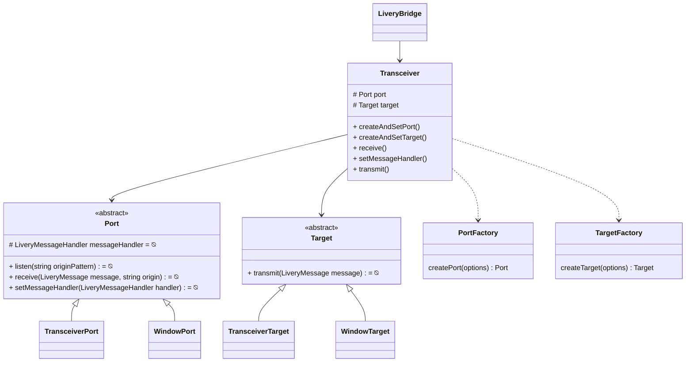

# Transceiver

There are multiple mechanisms by which `LiveryBridge` instances can communicate with other LiveryBridge instances. They can use the browser window's `postMessage` method, or directly invoke methods on another LiveryBridge instance. To embrace these multiple mechanisms without introducing branching logic to the methods of the LiveryBridge class and its descendents, we abstract away the details of this communication behind a Transceiver interface.

The Transceiver is responsible for all the sending and receiving of communication between a LiveryBridge and its correspondents (other LiveryBridge instances). Since it is entirely possible to have an asymmetrical communication arrangement, a Transceiver divides its own responsibility between a Target object, which is responsible for sending outgoing messages over some mechanism, and a Port object, which is responsible for receiving incoming messages over some mechanism.

There are several implementations of Port and several implementations of Target. A factory method creates and sets each of the Port and the Target. From then on out the low level implementation is irrelevant to the consumers.

## ownWindow

As with other parts of the bridge an ownWindow: Window object appears in various places. This is present primarily for testing purposes, allowing us to inject a Window object or test-double when we run tests without a browser.
